# Presence APP
## Introdução

O projeto consiste na idealização e implementação de uma API REST resposável por registrar presença em eventos e recolher feedback de usuários a cerca de eventos. No aspecto funcional, por via da leitura de um código gerado por quem ministra/organiza o evento, o usuário consegue utilizando um aplicativo mobile registrar sua presença no evento e fazer avaliações/comentários em tempo real sobre o evento.

O usuário é autenticado através  de um serviço de login, que pode implementar mecanismos como Oauth ou registe/sing-in. Ao digitar suas credencias o sistema devolve um token que dali pra frente é utilizado para fornecer

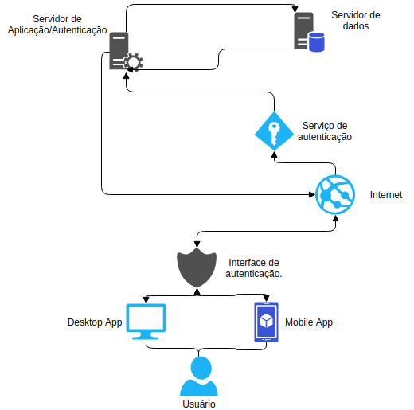

### Aparatos Tecnologicos

#### API

API (Application Protocol Interface - Protocolo de interface de aplicação) é um conjunto padrões que uma determinada aplicação estabelece para que outras aplicações consumam seus serviços sem a necessidade de saber detalhes sobre a implementação do software, disponibilizando uma interoperabilidade entre sistemas.
Utilizando do protocolo HTTP o principal protocolo da Web, a fundação sobre qual toda a informação da internet trafega, e implementando suas convenções uma API fornece recursos através de contratos de informações, através de requisições e os envia sob uma promessa de reposta ao solicitante.
Sobre esta premissa foi desenvolvido a aplicação,com o intuito de interoperabilidade e independencia da camada de apresentação.

##### Swagger

O swagger é uma projeto composto de ferramentas que auxiliam no desenvolvimento de API's REST.
Com ele é possível modelar, gerar documentos legíveis da API e até mesmo gerar códigos de esqueletos para o cliente e servidor facilitando o desenvolvimento da aplicação.
Em nosso projeto utilizamos somente a interface do Swagger UI para gerar e publicar a documentação dos serviços dos serviços da API jutamente com uma interface testável de suas funcionalidades e contrato.

O resultado pode ser verificado em no endereço http(s)://api-root/swagger/index.html

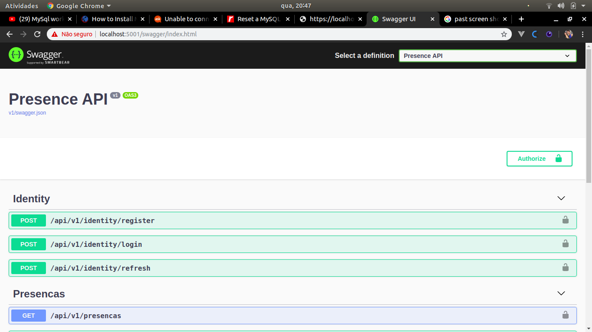
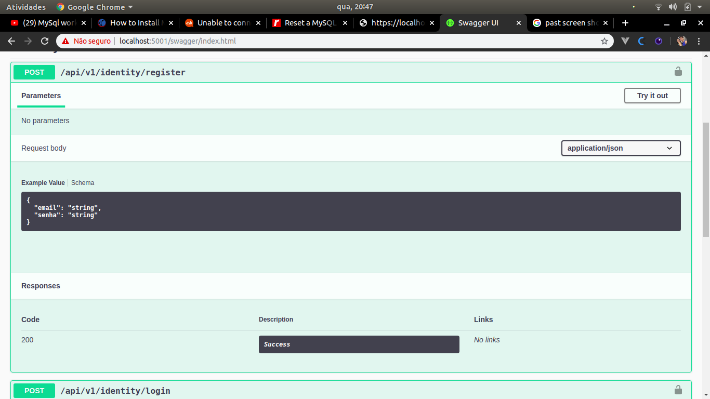

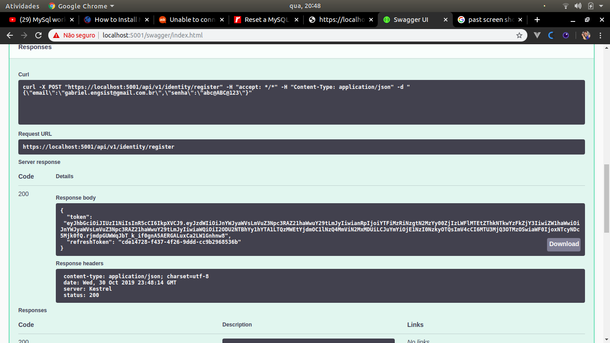
##### MySql

O MySql server é um sistema de gerenciamento de banco de dados popularmente conhecido e difundido. É através dele que salvamos toda a estrutura de dados de nossa aplicação e organizamos as apresentações e persistencia de informação para o usuário.

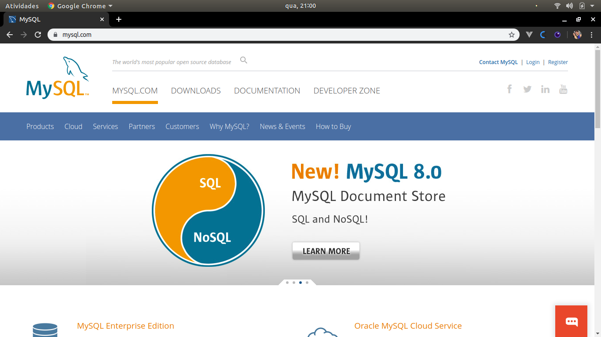

##### DotNet Core

Não menos importante e o motor de todo este engenho, está o DotNet Core. Reponsável por servir e disponibilizar toda a estrutura funcional da aplicação.
O DotNet Core consiste de uma solução de software livre multiplataforma 🖼🍎🐧 que disponibiliza vários recursos que possibilitam a criação de aplicações modernas e robustas. Ele serve como um interpretador e compilador de código além de um servidor de aplicação.

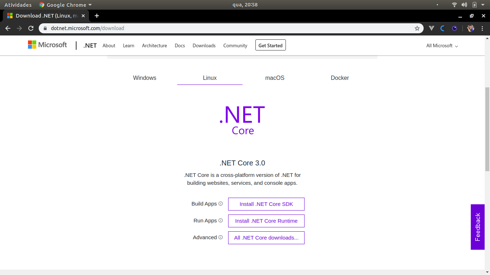
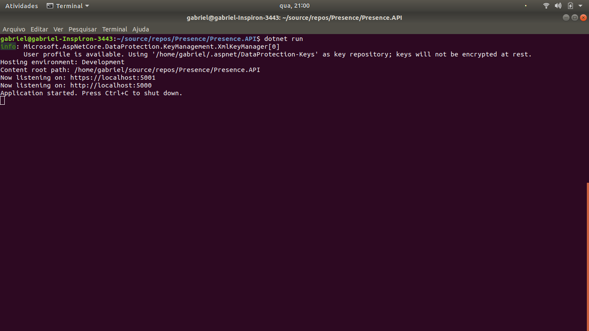
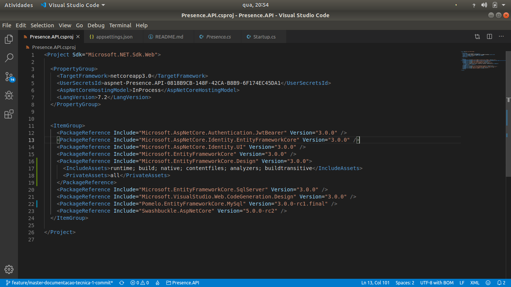

##### CSharp

CSharp é uma linguagem Orientada a Objetos criada pela Microsoft, é com ela que transformamos nossas idéias em uma aplicação funcional. Interpretada pelo DotNet Core é ela que contém toda a lógica por trás do funcionamento de nossa solução.

##### Entity Framework Core

O Entity Framework Core é o ORM (Object Relational Mapper - Mapeador de objeto-relacional) escolhido para fazer a gestão e persistencia da informação, ela serve como tradutora entre o código e serviço de banco de dados relacional escolhido. Utilizando da terminologia CodeFirst(Primeiro o código), serve como um facilitador traduzindo, gerando os scripts e a estrutura do banco de dados, de uma forma em que o programador se preocupe somente em escrever o código.

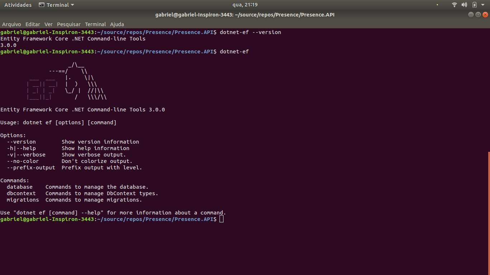

#### Aplicativo
##### Flutter

#### Outras Ferramentas
- Visual Studio Code - Editor de texto/IDE maleável que é utilizada no desenvolvimento do Front-End e do Back-end
- Post Man - Ferramenta para testes de conectividade da API, com ela é possível verificar respostas e efetuar testes de integração na aplicação.
- Visual Studio IDE - Ambiente de desenvolvimento gráfico que facilita o desenvolvimento de aplicações utiliando o DotNet Core.
- MySql Workbench - Interface para a modelagem e manipulação do banco de dados
### Metodologia
#### Scrum
Scrum é uma metodologia ágil para gestão e planejamento de projetos de software.

No Scrum, os projetos são dividos em ciclos (tipicamente mensais) chamados de Sprints. O Sprint representa um Time Box dentro do qual um conjunto de atividades deve ser executado. Metodologias ágeis de desenvolvimento de software são iterativas, ou seja, o trabalho é dividido em iterações, que são chamadas de Sprints no caso do Scrum.

As funcionalidades a serem implementadas em um projeto são mantidas em uma lista que é conhecida como Product Backlog. No início de cada Sprint, faz-se um Sprint Planning Meeting, ou seja, uma reunião de planejamento na qual o Product Owner prioriza os itens do Product Backlog e a equipe seleciona as atividades que ela será capaz de implementar durante o Sprint que se inicia. As tarefas alocadas em um Sprint são transferidas do Product Backlog para o Sprint Backlog.

A cada dia de uma Sprint, a equipe faz uma breve reunião (normalmente de manhã), chamada Daily Scrum. O objetivo é disseminar conhecimento sobre o que foi feito no dia anterior, identificar impedimentos e priorizar o trabalho do dia que se inicia.

Ao final de um Sprint, a equipe apresenta as funcionalidades implementadas em uma Sprint Review Meeting. Finalmente, faz-se uma Sprint Retrospective e a equipe parte para o planejamento do próximo Sprint. Assim reinicia-se o ciclo.

### Documentação

Para gerar a documentação utilizamos do Docsify, que é reponsável por indexar e disponibilizar a documentação da aplicação. Ele funciona como um site estático que interpreta Arquivos do Tipo MarkDown e faz uma linda camada de apresentação para o usuário.

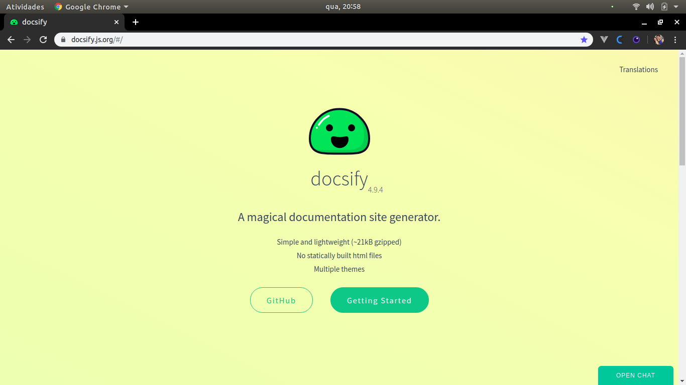
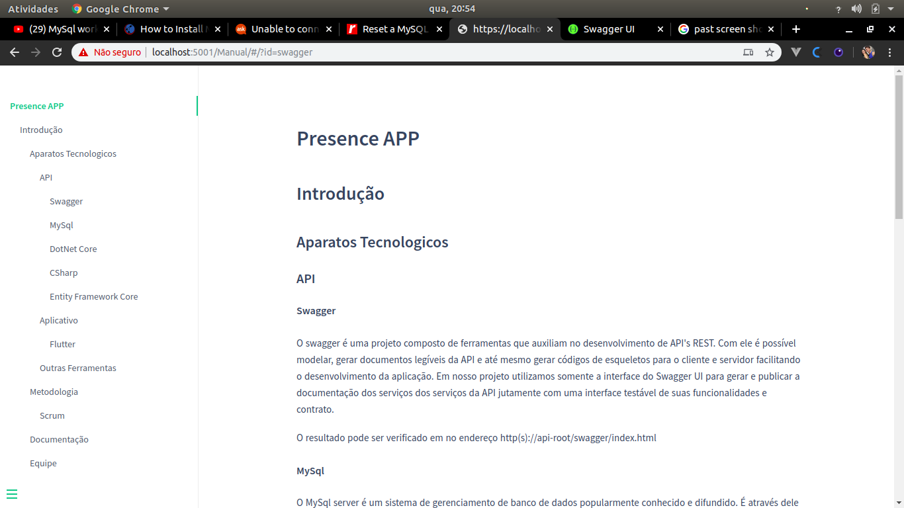